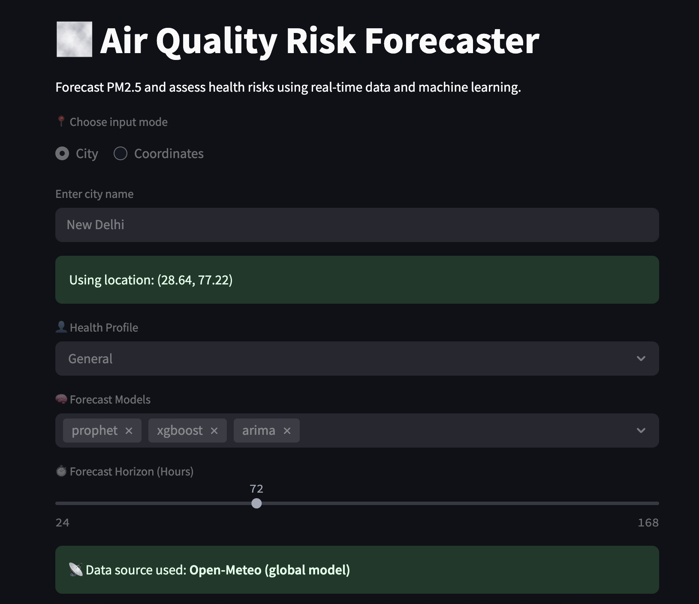
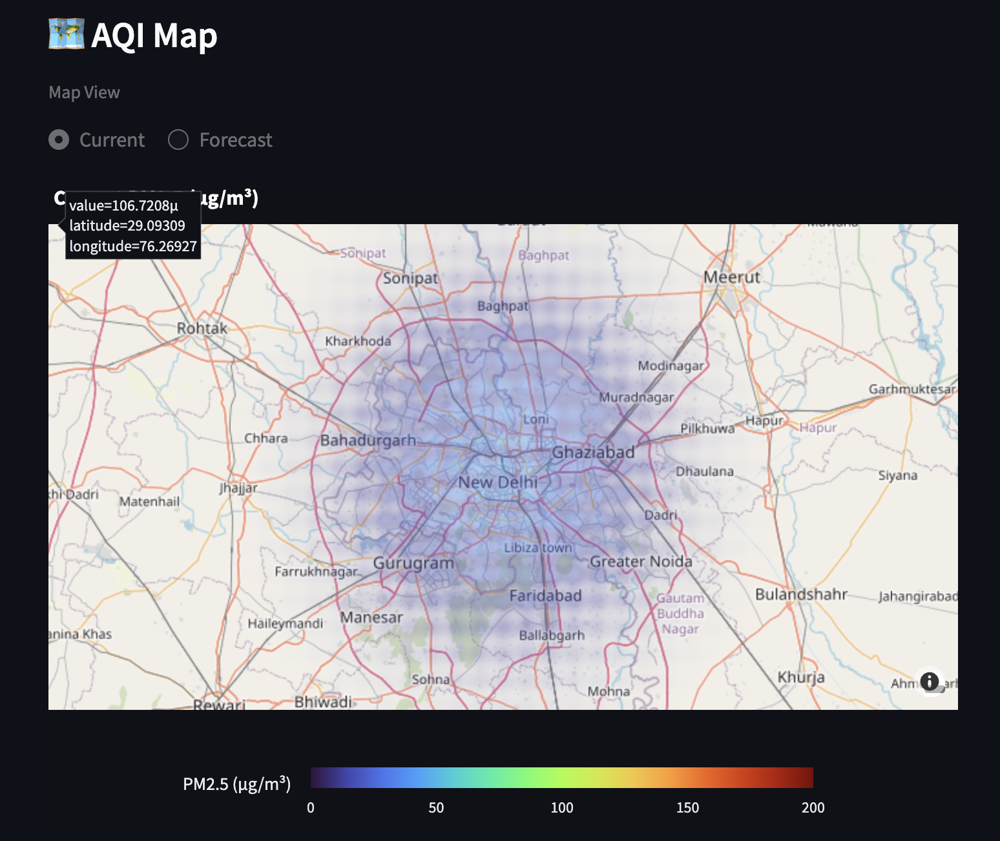
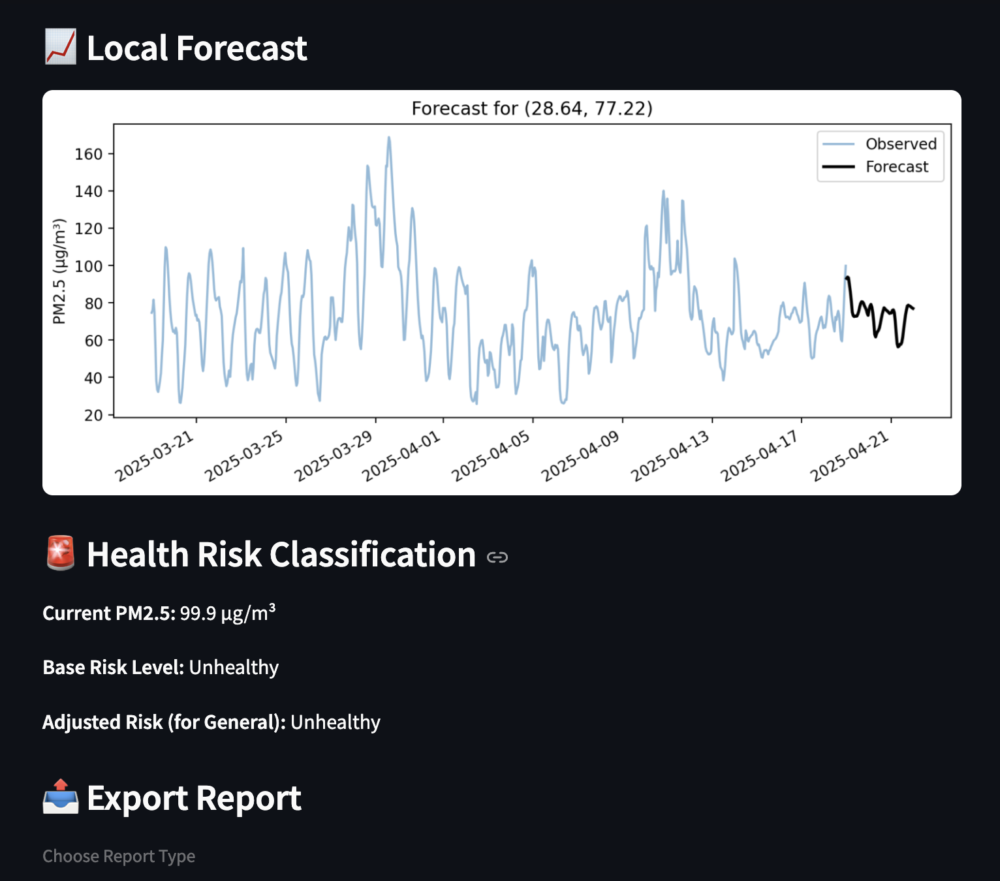

# 🌫️ AQI-Cast: Air Quality Risk Forecaster

Forecast PM2.5 air pollution and assess health risks using real-time AQI data and machine learning.
A lightweight version of this tool can be accessed at https://aqi-cast.fly.dev

📄 [Model Validation Report (PDF)](assets/AQI_Model_Validation_Report_Final.pdf)

## 🔍 What It Does

- Fetches **real-time AQI** data from OpenAQ or Open-Meteo
- Forecasts PM2.5 using **ML models**: Prophet, XGBoost, ARIMA, and more
- Classifies **health risk levels** using WHO/EPA guidelines
- Supports **city name or coordinate** input
- Displays **interactive AQI maps** and forecast plots
- Fully **Dockerized** and portable

---

## 🚀 Run the App via Docker

This app is available on Docker Hub for quick local deployment.

### 🔧 Prerequisites

- Docker installed and running: [Install Docker](https://www.docker.com/products/docker-desktop/)
- For Apple Silicon (M1/M2/M3), use `--platform=linux/amd64` if needed

### 📥 Pull the Image

```bash
docker pull mitraarka27/aqi-forecaster:latest
```

### ▶️ Run the App
```
docker run -p 8501:8501 mitraarka27/aqi-forecaster
```

Then visit: http://localhost:8501

⸻

🧪 Models Supported
	•	Prophet
	•	XGBoost
	•	ARIMA / SARIMA
	•	LightGBM
	•	Theta Model
	•	NeuralProphet
	•	Naive / Moving Average
	•	LSTM (optional)

⚠️ The Docker image excludes heavy models like TensorFlow-based LSTM by default to reduce size.

⸻

🧠 Risk Classification

Health risk levels are assigned based on:
	•	Real-time or forecasted PM2.5 levels
	•	Health profile (e.g. General, Asthmatic, Child, Elderly, Outdoor Worker)

⸻

🐳 Docker Hub
	•	📦 Image: mitraarka27/aqi-forecaster
	•	🏷️ Tag: latest

⸻

👷 CI/CD & DevOps
	•	✅ GitHub Actions for CI
	•	✅ Docker Hub publishing
	•	✅ Streamlit UI for clean local interface
	•	🛡️ .dockerignore and linting via flake8

⸻

📸 Here’s what the AQI Risk Forecaster looks like:

### 🌫️ Home UI


### 🌫️ Interactive Map


### 📈 Forecast Output

---

🛠️ Developer Setup

To run locally from source:
```
git clone https://github.com/mitraarka27/AQI-Cast.git
cd AQI-Cast
pip install -r requirements.txt
streamlit run app.py
```

🏁 License

MIT License. Built with ❤️ by @mitraarka27